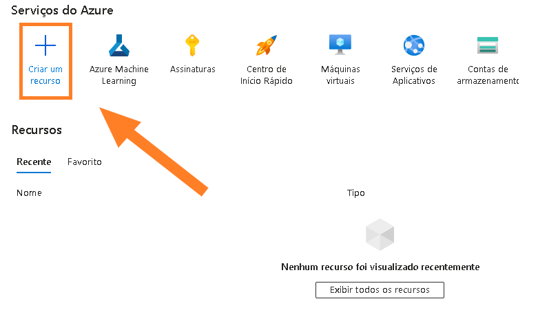
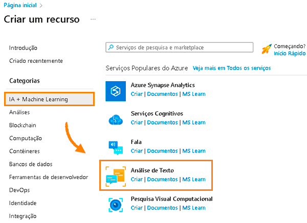

# *Análise de Sentimentos com Language Studio no Azure AI*

O processo usará recurso de Inteligencia Artificial do Azure, que inclui os serviços do Azure Linguage Studio para testar as possibilidades para Análise de Sentimento e Mineração de Opinião.

### Objetivos da Solução

Trazer o entendimento sobre como o emprego de inteligência artificial com recursos de Análise de Sentimentos e Mineração de Opinião podem proporcionar avanços significativos para uma empresa:

- Entender as necessidades, preferências e expectativas dos clientes.

- Melhorar a experiência do cliente, oferecendo produtos e serviços personalizados, resolvendo problemas com agilidade e eficiencia, aumentando a satisfação e fidelidade.

- Colher insights valiosos sobre o mercado, concorrência, tendência e oportunidades de negócio, através da mineração de textos de fontes diversas, como notícias, relatórios, pesquisas, etc.

- Aumentar a produtividade e eficiência, automatizando processos que envolvem a análise de grandes volumes de dados textuais, reduzindo custos e erros humanos.

### Sobre a Análise de Sentimento

Esse recurso fornece rótulos de sentimentos (*como negativo, neutro e positivo*) com base na pontuação de confiança mais alta encontrada pela IA em um nível de frase e documento. Ele também retorna pontuações de confiança entre 0 e 1 para cada documento e frase dentro dele para um sentimento positivo, neutro e negativo.

### Sobre a Mineração de Opinião

Se trata de um recurso da Análise de Sentimento, também conhecida como Análise de Sentimento baseada em aspecto no Processamento de idioma natural (NLP), esse recurso fornece informações mais granulares sobre as opiniões relacionadas a palavras (como os atributos de produtos ou serviços) contidas no texto.

### Preparando o ambiente

Para executar esse passo a passo é necessário ter uma conta devidamente configurada no portal Azure. (*Configure seu primeiro acesso gratuitamente [clicando aqui](https://azure.microsoft.com/pt-br/free/)*.)

### Acessando o portal Azure

Ao acessar o portal de serviços do Azure você verá uma interface web que permite gerenciar e pesquisar recursos de forma fácil e intuitiva.

O painel sugere as informações mais relevantes inicialmente, podendo ser personalizado para o seu cenário. Também é possível navegar pelos menus laterais para explorar os diferentes serviços, como computação, armazenamento, rede, banco de dados, inteligência artificial, entre outros. 

O portal de serviços do Azure é uma ferramenta poderosa e flexível que facilita o uso da nuvem da Microsoft. 🌐

### Configurando recurso

Irei iniciar criando um novo recurso necessário, a configuração correta de recursos no Azure é essencial para garantir o seu funcionamento adequado, segurança, escalabilidade e otimização de custos.

Cada recurso do Azure possui uma série de configurações que podem ser ajustadas de acordo com necessidades e objetivos de cada negócio. 

Para isso basta clicar em `Criar um recurso`, como mostra a imagem:

Em seguida navegue pelo menu esquerdo selecionando `IA + Machine Learning` e clique em `Criar` na opção **Análise de texto**.

### Conclusão

A análise de sentimentos com o Language Studio no Azure AI oferece uma série de benefícios e vantagens para os usuários que desejam entender as opiniões expressas em texto. Aqui está uma conclusão sobre essa ferramenta:

Precisão: O Language Studio no Azure AI é conhecido por sua precisão na análise de sentimentos. Ele emprega modelos de linguagem avançados e técnicas de aprendizado de máquina para identificar com precisão o tom emocional do texto, seja ele positivo, negativo ou neutro.

Multilíngue: Uma das principais vantagens é a capacidade de analisar sentimentos em vários idiomas. Isso o torna valioso para empresas globais que desejam entender o sentimento do cliente em diferentes regiões e mercados linguísticos.

Escalabilidade: O serviço é altamente escalável, podendo lidar com grandes volumes de texto para análise de sentimentos em tempo real. Isso é crucial para empresas com grandes bases de dados de texto que precisam de insights em tempo hábil.

Integração com o Azure: Como parte do ecossistema do Azure AI, o Language Studio pode ser facilmente integrado a outras soluções e serviços da Microsoft, proporcionando uma experiência de desenvolvimento e implantação suave para os usuários.

Personalização: O Azure AI permite que os usuários personalizem e ajustem os modelos de análise de sentimentos para atender às suas necessidades específicas de negócios. Isso inclui a capacidade de treinar modelos com dados específicos do domínio para melhorar a precisão das análises.

No entanto, é importante considerar que a precisão da análise de sentimentos pode variar dependendo da complexidade do texto, do contexto cultural e das nuances linguísticas. Além disso, como em qualquer análise automatizada, pode haver casos em que a interpretação do sentimento não corresponda perfeitamente à intenção do autor.

Em resumo, a análise de sentimentos com Language Studio no Azure AI oferece uma poderosa ferramenta para empresas que desejam compreender e responder às opiniões expressas em texto de maneira rápida e eficaz, contribuindo para uma melhor compreensão do feedback do cliente, monitoramento da reputação da marca e tomada de decisões estratégicas.

